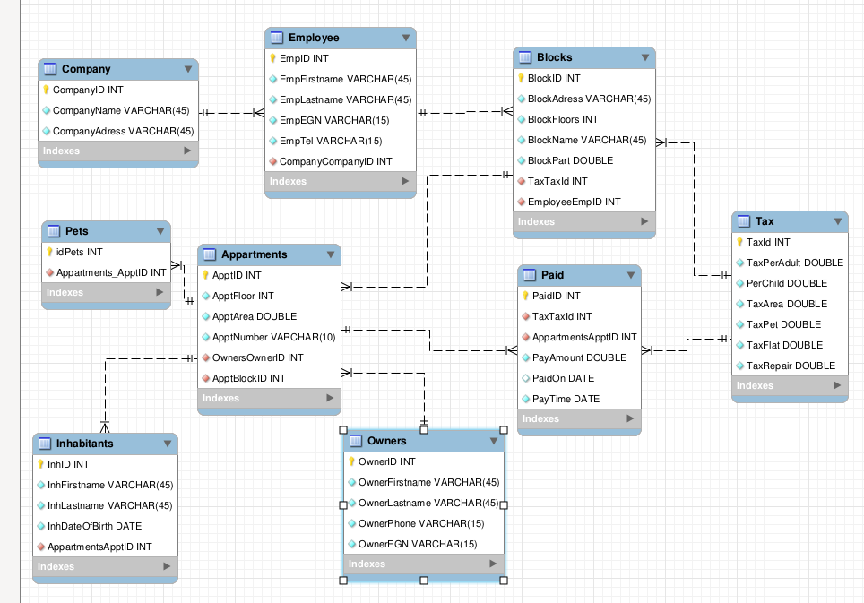

# Документациия на 'Е-домоуправител'

## База Данни
- Erd view


### Company
- CompanyID `Номер на компанията - авто генериран и уникален`
- CompanyName `име на компанията`
- CompanyAdress `адрес на компанията`

### Appartments
- ApptID `авто генериран и уникален`
- ApptFloor `Етаж`
- ApptArea `Площ на апартамента`
- ApptNumber `Номер на апартамента, но е текстов низ ,за да може да има апартаменти като 15А`
- OwnersOwnerID - OwnerID  `Връзка с таблицата за собственици`
- ApptBlockID - BlockID` Връзка с таблицата за Блокове. Един апартамент писъства само в един блок`

### Blocks
- BlockID `авто генериран и уникален`
- BlockAdress `Адрес на блока`
- BlockFloors `Брой етажи`
- BlockName `Име на блока. Реално трябва да е нещо като 001 но в момента е има`
- BlockPart `Застроена площ, като цяло не се ползва`
- TaxTaxId - TaxId `Връзка с таблицата Която определя таксите - Глобални за блок`
- EmployeeEmpID - EmpID `Работник който се грижи за блока`

### Employee
- EmpID `Номер на работника - авто генериран и уникален`
- EmpFirstname `Име на работника`
- EmpLastname `Фамилия`
- EmpEGN `Егн`
- EmpTel `Телефон`
- CompanyCompanyID - CompanyID `Връзка с Таблицата с фирмите`


### Inhabitatns -
- InhID `Номер на живущия в апартамента`
- InhFirstname `Име`
- InhLastname `Фамиллия`
- InhDateOfBirth `Дата на раждане`
- AppartmentsApptID ApptID `Връзка с таблицата за апартаментите, в кой живее.`

### Owners
- OwnerID `Номер на собственика`
- OwnerFirstname `Име`
- OwnerLastname `Фамилия`
- OwnerPhone `Телефон`
- OwnerEGN `Егн`

### Paid
В тази таблица всеки месец се добавят нови фактури, за съответния месец.
 - PaidID `Номер на фактурата`
 - PayAmount `Сума за плащане. Сумата е снапшот.`
 - PaidOn `Дата на плащане. Ако не е платена е 'null'.`
 - PayTime `Дата на издаване`
 - TaxTaxId TaxId `Връзка с таблицата за коя такса е използвано за тази сметка`
 - AppartmentsApptID ApptID `Номер на апартамент на който е сметката`
### Pets
 - idPets `Номер на животното, авто генериран и уникален - `
 - Appartments_ApptID `В кой апартамент е `

### Tax
- TaxId `Номер на таксата`
- TaxPerAdult `Цена за възръстен`
- PerChild `Цена за дете`
- TaxArea `Цена на квадрат`
- TaxPet `Цена за животно`
- TaxFlat `Плоска цена за такса`
- TaxRepair `Такса за поддръжка на входа`

## Data Generation
Данните са генерирани с класа [VladoRandoma.java](src/main/java/org/example/utils/VladoRandoma.java)
сингълтън с сийднат рандом генератор.

С него се генерират всички данни в базата
- имена - всички имена са 10 сивола
- егн, тел и тн - 10-12 символа
- брой апартаменти в блок 
- дали има животно 
- брой живущи в апартамент

## Implemented queries - слой с услуги
1. Създаване, редактиране и изтриване на компании с данни за тях
    - [Company.java](src/main/java/org/example/entity/Company.java)
    - [CompanyDao.java](src/main/java/org/example/dao/CompanyDao.java)
        * `save(Company)`
        * `findById(int)`
        * `findAll()`
        * `update(Company)`
        * `delete(int)`
        * `clear()`

2. Създаване, редактиране и изтриване на сгради с данни за тях (адрес, брой етажи, брой апартаменти, застроена площ, общи части и т.н.)
    - [Blocks.java](src/main/java/org/example/entity/Blocks.java)
    - [BlocksDao.java](src/main/java/org/example/dao/BlocksDao.java)
        * `save(Blocks)`
        * `findById(int)`
        * `findAll()`
        * `update(Blocks)`
        * `delete(int)`
        * `clear()`

3. Създаване, редактиране и изтриване на собственици на апартаментите и живущите в тях
    - [Appartments.java](src/main/java/org/example/entity/Appartments.java)
    - [AppartmentsDao.java](src/main/java/org/example/dao/AppartmentsDao.java)
        * `save(Appartments)`
        * `findById(int)`
        * `findAll()`
        * `update(Appartments)`
        * `delete(int)`
        * `clear()`

4. Създаване, редактиране и изтриване на служители на фирмата
    - [Employee.java](src/main/java/org/example/entity/Employee.java)
    - [EmployeeDao.java](src/main/java/org/example/dao/EmployeeDao.java)
        * `save(Employee)`
        * `findById(int)`
        * `findAll()`
        * `update(Employee)`
        * `delete(int)`
        * `clear()`

5. Определяне на сградите, които обслужва всеки от служителите на фирмата
``` java
    public static void saveForCompany(Blocks block, Integer compId){ ... }
```
С тази заявка извеждаме и подреждаме кой работник има най-малко блокове и
назаначавме него. Може и по оптимално в случай че имаме много блокове наведнъж,
но чисто добавяне няма да е толкова интензивен процес.
``` sql
    SELECT em.empId
    FROM Blocks bl 
    INNER JOIN bl.employee em 
    WHERE em.company.companyId = :cmpid 
    GROUP BY em.empId
    ORDER BY count(bl) 
```

6. Въвеждане на такса, която трябва да се плаща от живущите в сграда
    - [Tax.java](src/main/java/org/example/entity/Tax.java)
    - [TaxDao.java](src/main/java/org/example/dao/TaxDao.java)
        * `save(Tax)`
        * `findById(int)`
        * `findAll()`
        * `update(Tax)`
        * `delete(int)`
        * `clear()`

7. Плащане на таксите. Въвеждане на платените такси
За да се платят таксите те първо трябва да се сметнат кой колко дължи. 
Тази стойнсот след това отива в таблица `Paid` имаме - за кой апартамент е, коя
'тарифа', колко е стойността за плащане, кога е платена, кога е издаена тази
сметка.

Смятането става на няколко части със следните заявки:
 - Изчисляване на сумата : такса за хората според възрастта

``` sql
        with people as (select
        a.ApptID,
        sum(if(timestampdiff(YEAR, i.InhDateOfBirth,NOW()) > 7,t.TaxPerAdult,t.PerChild)) as si
        from mydb.Blocks b
        join mydb.Appartments a on b.BlockID = a.ApptBlockID
        join mydb.Tax t on b.TaxTaxID = t.TaxID
        join mydb.Inhabitants i on a.ApptID = i.AppartmentsApptID
        group by a.ApptID ),
```
- Изчисляване на сумата : за домашни животни:

``` sql
        pets as (
        select
        a.ApptID,
        sum(t.TaxPet) as sp
        from mydb.Blocks b
        join mydb.Appartments a on b.BlockID = a.ApptBlockID
        join mydb.Tax t on b.TaxTaxID = t.TaxID
        join mydb.Pets p on a.ApptID = p.Appartments_ApptID
        group by a.ApptID)
```
- Изсляване на сумата : заедно с останалите такси

``` sql
        select a.ApptID, t.TaxID,
        t.TaxArea * a.ApptArea +
        people.si +
        pets.sp +
        t.TaxFlat +
        t.TaxRepair as tax
        from mydb.Blocks b
        join mydb.Appartments a on b.BlockID = a.ApptBlockID
        join mydb.Tax t on b.TaxTaxID = t.TaxID
        join people on a.ApptID = people.ApptID
        join pets on a.ApptID = pets.ApptID
```
И от това получаваме една таблица с нужната информация да образуваме ред в
`Paid` - `AppawrtmentId` , `TaxId` , `Amount`. С тази таблица започваме да
образуваме `INSERT INTO` заявка за да въведем новите редове.
``` sql
insert into mydb.Paid(TaxTaxID,AppartmentsApptID,PayAmount,PaidOn,PayTime) values
```
Последвана от най много 50
``` java
String.format((%d,%d,%f,null,NOW()),", TaxId,ApptID,tax);
```
Възможно е това да стане директно с една заявка, но в тази версия на Mysql не е
възможно да се направи  'with' последвано с `Insert into` , не успя да стане и с
временни таблици. Затова имплантираме paging с по най-много`50` (и повече може)
резултата от една операция  Така не се интересуваме от колко точно са сметките
за този месец, и не лесно можем да си надхвърли рам паметта.

8. Филтриране и сортиране на данните за:
a. Компаниите: по приход (събрани такси)
``` java
    public static List<Pair<Company,Double>> filterCompaniesOnAllIncome(Boolean ascending) { ... }
```
С ето тази заявка взимаме нужното
``` sql
 SELECT c, sum(p.payAmount)
 FROM Paid p
 INNER JOIN p.appartments a
 INNER JOIN a.block b
 INNER JOIN b.employee e
 INNER JOIN e.company c
 WHERE p.paidOn != null
 GROUP BY c.companyId
 ORDER BY sum(p.payAmount)
```
Като добавяме накрая `ASC` илл `DESC` в зависимост от булевия аргумент

b. Служителите на компанията (по име и по брой обслужвани сгради)
- Сортиране по име, аналогично на сортирането на компаниите:
``` java
    public static List<Employee> sortByName(Boolean ascending) { ...}
```
С тази заявка можем да изведем нужното:
``` sql
   SELECT e FROM Employee e ORDER BY e.empFirstname
```
- Сортиране по менажирани блокове аналогично на сортирането на компаниите:
``` java
public static List<Pair<Employee,Long>> sortByManagedBlocks(Boolean ascending) {...}
```
С тази заявка можем да изведем нужното:
``` sql
SELECT e, count(b)
FROM Blocks b
INNER JOIN b.employee e
GROUP BY e.empId
ORDER BY count(b)
```
c. Живущите в сградите (по име и по възраст)
- Сортиране по име, аналогично на сортирането на компаниите:
``` java
    public static List<Pair<String,Long>> sortYears(Boolean ageAscending);
```
С тази заявка можем да изведем нужното, като тя трябва да е на sql вместо
hibernate ql, защото нямаме възможност да извикаме TIMESTAMPDIFF.

``` sql
    SELECT mydb.Inhabitants.InhLastname as name,
    TIMESTAMPDIFF(YEAR, mydb.Inhabitants.InhDateOfBirth, NOW()) as age
    FROM mydb.Inhabitants
```

9. Обобщени и подробни справки (общ брой и списък) за:
a. Обслужвани сгради от всеки служител във дадена фирма

С тази функция можем заземем списък на обслужваните сгради на всеки служители в една фирма
``` java
    public static List<Pair<Employee,Blocks>> managedBlocksForCopmany(Company c) { ... }
```
С тази заявка може да вземем нужното, където :compid е номера на компанията от аргумента
``` sql
    SELECT e, b
    FROM Blocks b
    INNER JOIN b.employee e
    WHERE e.company.companyId = :compid
```

С тази функция можем заземем броя на обслужваните сгради на всеки служители в една фирма
``` java
    public static List<Pair<Employee,Long>> managedBlocksCount(Company c) { ... }
```
С тази заявка може да вземем нужното, където :compid е номера на компанията от аргумента
``` sql
SELECT e, count(b) FROM Blocks b INNER JOIN b.employee e WHERE e.company.companyId = :compid GROUP BY e.empId
```


b. Апартаменти в сграда
Вземаме апартаментите в една сграда по този начин:
``` java
    public static List<Appartments> getAppartmentsInBlock(Blocks b) { ... }
```
С тази заявка:
``` sql
    SELECT a FROM Appartments a INNER JOIN a.block b WHERE b.blockId = :blid";
```
Аналогично за броя, връщаме едноелементен списък с броя
``` java
    public static List<Long> getAppartmentsInBlockCount(Blocks b) { ... }
```
С ето тази завка:
``` sql
    SELECT count(a) FROM Appartments a INNER JOIN a.block b WHERE b.blockId = :blid
```
c. Живущи в сграда

Получаваме живущите в определена сграда от тази:
``` java
    public static List<Inhabitants> getInhabitantsIn(Blocks b) { ... }
```
Чрез тази заявка:
``` sql
SELECT i FROM Inhabitants i INNER JOIN i.appartment a INNER JOIN a.block b WHERE b.blockId = :blid
```

Получаваме броя живущите в определена сграда от тази:
``` java
    public static List<Long>  getInhabitantsCountIn(Blocks b) { ... }
```
Чрез тази заявка:
``` sql
SELECT count(a) FROM Appartments a INNER JOIN a.block b WHERE b.blockId = :blid
```

d. Суми за плащане (за всяка компания, за всяка сграда, за всеки служител)
- За компании:
``` java
    public static List<Pair<Company,Double>> MoneyToBeCollected() { }
```
С ето тази заявка:
``` sql
    SELECT c, sum(p.payAmount) 
    FROM Paid p 
    INNER JOIN p.appartments a  
    INNER JOIN a.block b 
    INNER JOIN b.employee e 
    INNER JOIN e.company c 
    WHERE p.paidOn = null 
    GROUP BY c.companyId"
```
- за блок
``` java
    public static List<Pair<Blocks,Double>> MoneyToBeCollected() { ... }
```

С ето тази заявка:
```sql
    SELECT b, sum(p.payAmount)
    FROM Paid p
    INNER JOIN p.appartments a
    INNER JOIN a.block b
    WHERE p.paidOn = null
    GROUP BY b.blockId
```
- за служител
```java
    public static List<Pair<Employee,Double>> MoneyToBeCollected() {...}
```
С ето тази заявка:
```sql
    SELECT e, sum(p.payAmount)
    FROM Paid p
    INNER JOIN p.appartments a
    INNER JOIN a.block b
    INNER JOIN b.employee e
    WHERE p.paidOn = null
    GROUP BY e.empId";
```
e. Платени суми (за всяка компания, за всяка сграда, за всеки служител)
- За компании:
``` java
    public static List<Pair<Company,Double>> MoneyCollected() { }
```
С ето тази заявка:
``` sql
    SELECT c, sum(p.payAmount) 
    FROM Paid p 
    INNER JOIN p.appartments a  
    INNER JOIN a.block b 
    INNER JOIN b.employee e 
    INNER JOIN e.company c 
    WHERE p.paidOn != null 
    GROUP BY c.companyId"
```
- за блок
``` java
    public static List<Pair<Blocks,Double>> MoneyCollected() { ... }
```

С ето тази заявка:
```sql
    SELECT b, sum(p.payAmount)
    FROM Paid p
    INNER JOIN p.appartments a
    INNER JOIN a.block b
    WHERE p.paidOn != null
    GROUP BY b.blockId
```
- за служител
```java
    public static List<Pair<Employee,Double>> MoneyCollected() {...}
```
С ето тази заявка:
```sql
    SELECT e, sum(p.payAmount)
    FROM Paid p
    INNER JOIN p.appartments a
    INNER JOIN a.block b
    INNER JOIN b.employee e
    WHERE p.paidOn != null
    GROUP BY e.empId";
```
10. Данните за платените такси трябва да се записват във файл. Информацията, която се
записва включва: фирма, служител, сграда, апартамент, сума, дата на плащане.
Необходимо е реализацията на проекта да включва релационна БД, слой с услуги, реализиран
на Java и валидация на данните, които се въвеждат и обработват.
Става в:
```java
    public static void ExportPaymentToCsv(String fname) { ... }
```
С ето тази заявака вземаме данните:
```sql
SELECT c.companyId,c.companyName,e.empFirstname,e.empLastname,b.blockName,a.apptNumber, p.payAmount, p.paidOn
FROM Paid p
INNER JOIN p.appartments a
INNER JOIN a.block b
INNER JOIN b.employee e
INNER JOIN e.company c
WHERE p.paidOn != null";
```
и ги записваме в  csv с име `fname`.
